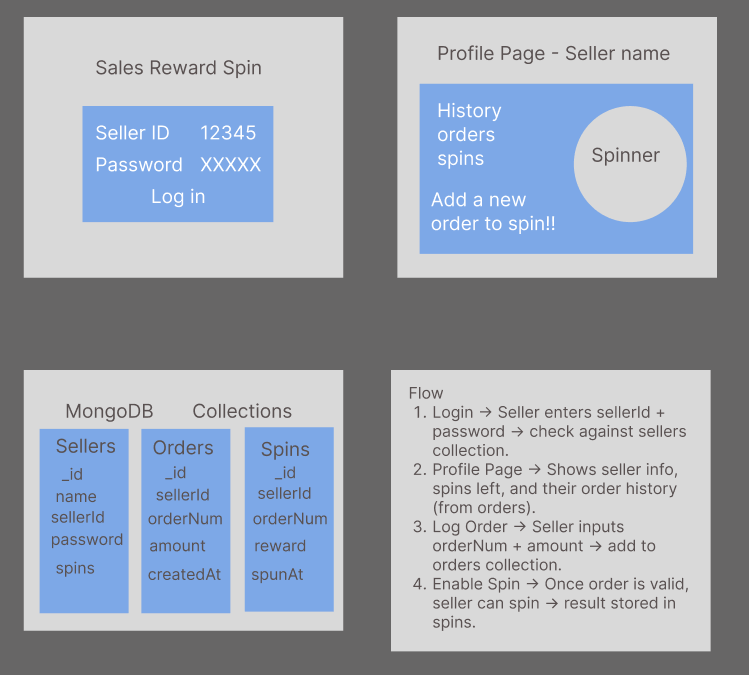

# 🎰 Reward Spinner Project

This project is a full-stack application where sellers can log in, register their orders, and use spins to win rewards.

## 📂 Project Structure

apps/

 ├── backend/

 └── frontend/

## 🚀 Features

- Authentication: Sellers can log in using sellerId + password.

- Orders: Sellers can add orders and view their order history.

- Spins: Each seller has spins available based on orders.

    - One spin per order.

    - Random reward generation.

    - Prevents duplicate spins for the same order.

- Spin History: Sellers can view past spins, total rewards, and remaining spins.

- Protected Routes: Orders and spins require a valid JWT token.

## 🛠️ Tech Stack

### Backend

- Node.js

- Express

- MongoDB (Mongoose)

- JSON Web Tokens (JWT)

- CORS

## Frontend

- React (Vite)

- TypeScript

## Endpoints

|                  |        |                                        |
|------------------|--------|----------------------------------------|
|Action            | Method | URL                                    |
|Test server       | GET	| http://localhost:3000/                 |
|Login	           | POST   | http://localhost:3000/auth/login       |
|Logout            | POST	| http://localhost:3000/auth/logout      |
|Add order         | POST   | http://localhost:3000/orders/add-order |
|Get seller orders | GET	| http://localhost:3000/orders/:sellerId |
|Spin reward	   | POST   | http://localhost:3000/spins            |
|Get spin history  | GET	| http://localhost:3000/spins/:sellerId  |

## Design

## Authors

Made by Sue Holding and Oliwia Matuttis